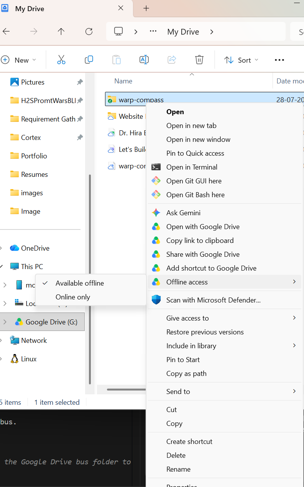

# Warp Compass — Brain (cognition plane)

The laptop batch pipeline: **extract → resolve (create gate) → conflict/coverage → planner**
over an **OKF Markdown graph bundle** (no database server — P12). Python + [uv](https://docs.astral.sh/uv/).

> **Status:** all phases done (P0–P12). Operating routine: `../OPERATOR-MANUAL.md`. Track
> progress in `../PROGRESS.md`.

## Prerequisites
- Python 3.12+
- [uv](https://docs.astral.sh/uv/getting-started/installation/)

That's it — **no Neo4j, no Docker, no database**. The knowledge graph is a folder of Markdown
files (one per node) that the pipeline reads/writes directly.

## Setup
```bash
cd brain
uv sync                       # resolve deps into .venv
cp .env.example .env          # then set DEEPSEEK_API_KEY (+ BUS_ROOT for the Drive folder)
```

## Where the graph lives (P12 — OKF bundle; local since P14)

The graph is a directory of Markdown files with YAML frontmatter, set by **`GRAPH_ROOT`** in
`brain/.env` and defaulting to `{BUS_ROOT}/graph`. **Point it at local disk (`./_graph`), not at
the Drive folder.** The default put it on the Drive virtual drive so it would back up for free, and
that turned out to be the wrong trade: the store rewrites a whole node file on every touch and
rewrites *both* endpoints of every edge, so one round issues hundreds of atomic writes — and each
`os.replace` costs Google Drive a delete-approval round-trip. Enough of them exhaust Drive's
user-mode FS driver, at which point *every* operation on the drive (reads and `stat` too) fails with
`WinError 1450` and the round dies. The bundle is brain-private — the PWA never reads it — so
nothing needs it on Drive.

**Back it up with git instead of Drive**, which is what the format is good at (`../OKF-vs-Neo4j-report.md`
§3): readable diffs, blame, and history per node. `_graph/` is deliberately *not* in `.gitignore`;
commit it if you want that history, or add it if you'd rather not. Either way the graph is
re-derivable from the Answer Logs, which do live on Drive.

Layout:

```
graph/
  index.md            # generated overview (counts + links per type)
  roles/role.sales-manager.md
  activities/act.check-stock.md
  systems/ · artifacts/ · events/ · rules/ · problems/ · ...
```

Each node file: frontmatter = machine truth (`type`, `title`, `keywords` (aliases),
`description`, `status`, `provenance`, outgoing `edges` with per-edge provenance); body =
generated human/LLM view with timestamped Facts and two-way `[[wiki-links]]` (Links on the
giver, Backlinks on the receiver). Read them freely; **don't hand-edit** — the pipeline owns
them, and everything is re-derivable from the immutable Answer Logs anyway.

> **Always run uv/Python commands from this `brain/` directory.** `uv run` discovers the project
> via `pyproject.toml` here; running from elsewhere gives `No module named 'warp_compass_brain'`.
> It also matters for the relative paths in `.env` (`GRAPH_ROOT=./_graph`, `_state/`) — running
> from elsewhere would silently start a second, empty graph.

## When the bus is on Google Drive (P14)

The bus folder *must* be shared, so it stays on Drive — but it's only a few small files per round.
Two things make that survivable:

1. **Make the folder available offline** (right-click the folder → *Available offline*, or run Drive
   in *Mirror files* mode). Then every read and write hits real local disk and Drive syncs in the
   background. This is step 1 of `../DEPLOY.md`'s Drive setup and it is not optional — stream-only
   is what turns a round into hundreds of blocking network round-trips.

   
2. **Transient failures are retried** (`fsretry.py`). Drive's driver fails in bursts, so every bus
   and graph operation backs off and retries before giving up — tuned with `FS_RETRY_ATTEMPTS` /
   `FS_RETRY_BASE_DELAY`. You'll see `[fs-retry] WARNING: … sync drive busy, retrying` on stderr
   when it kicks in; frequent warnings mean the folder is still stream-only.

Retrying only helps when Drive *raises* an error. If it *blocks* instead, the round just hangs —
only (1) fixes that. A round is resumable either way (`profile.json["ingested_logs"]`), so
interrupting and re-running never re-ingests a log or double-pays DeepSeek.

## Ingest pipeline (works today)
```bash
# confirm which DeepSeek models your key can access
uv run python -m warp_compass_brain.cli check-models
# turn one answer into graph nodes. Add --extra vectors for semantic dedup embeddings.
uv run --extra vectors python -m warp_compass_brain.cli ingest \
  "An order comes in, I check stock, then escalate big ones to the manager." --persona persona.A
```

## Run the tests
```bash
uv run pytest                 # the whole suite — no database or network needed (113 tests)
uv run ruff check .           # lint
```

## Layout
```
src/warp_compass_brain/
  models.py        # NodeCard, Edge, Provenance, enums (mirror contracts/)
  ontology.py      # loads + validates against contracts/ontology.json (the compass)
  config.py        # env-driven settings (GRAPH_ROOT, BUS_ROOT, keys)
  graphstore/      # GraphStore ABC (swap seam) + OkfGraphStore (Markdown bundle)
  vectorindex/     # local embeddings + sqlite cosine index (semantic dedup)
tests/
```

Migrating pre-P12 Neo4j data (one-off): `uv run --with neo4j python ..\scripts\migrate_neo4j_to_okf.py`
— or just rebuild from the Answer Logs (clear `ingested_logs` in each `profile.json`, re-run a round).

The graph is **re-derivable** from the raw Answer Log (the immutable source of truth), so the
store is a low-stakes working copy. See `../docs/plan/phase-12-okf-store.md` and
`../docs/02-technical-approach.md`.
