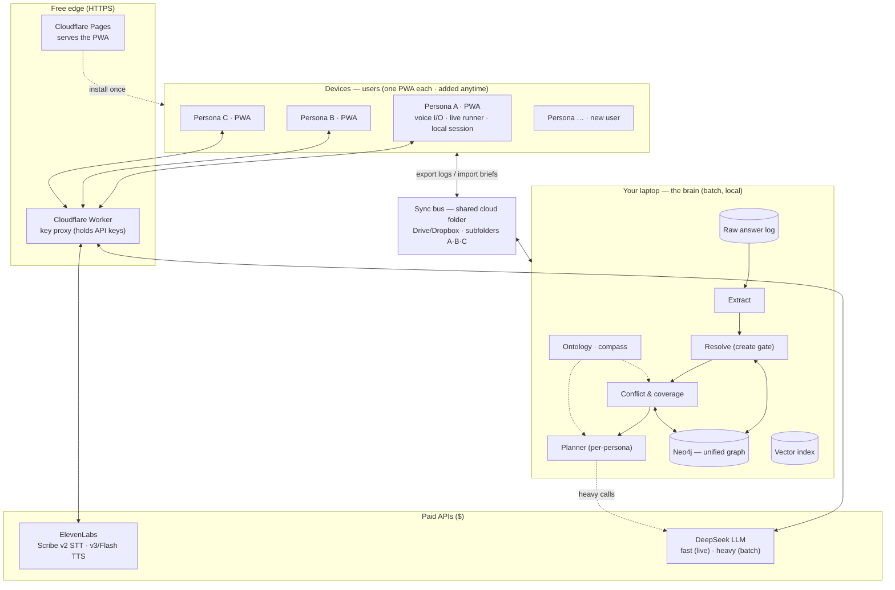
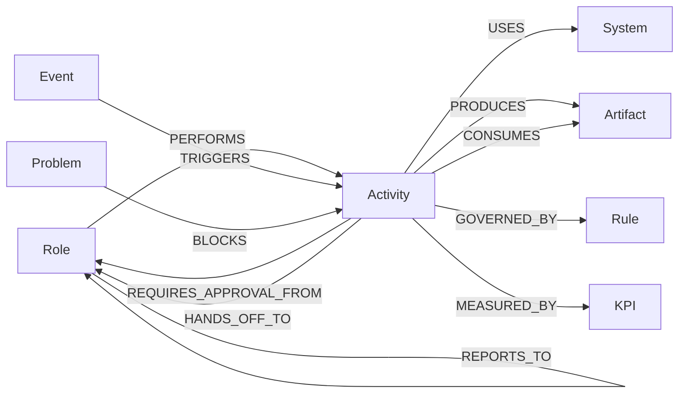
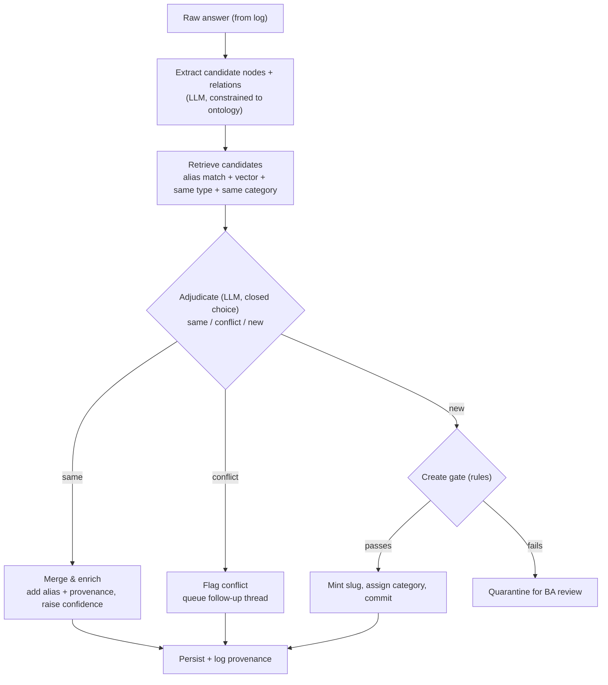

# AI SOP & End-to-End Process Engine — Technical Approach (v3)

> Build-ready technical design. The system's job is to understand the **complete SOP at
> every level of a company, connect it all, and synthesize one end-to-end process** (plus
> a problem register). Discovery (the conversation) is the method; the connected SOP /
> end-to-end process is the output. Three ideas carry the whole thing:
> (1) a **two-speed architecture** — a fast live conversation and a slow "thinking"
> layer that runs between sessions; (2) **discovery-first** — no predefined
> questionnaire; the agent starts from generic openers and lets structure emerge, with
> a fixed **ontology** acting only as an internal completeness compass; and (3) a
> **graph-first brain** where the LLM *proposes* knowledge and *deterministic rules
> dispose* of it, which keeps the model clean and hallucination low. The end-to-end
> process is literally a traversal of that graph across all personas.
>
> **What changed from v2:** reframed to the **SOP / end-to-end-process** goal (architecture
> unchanged); removed the predefined questionnaire (now discovery-first); personas are
> discovered, not BA-defined; added the concrete **prototype topology** (PWA + Cloudflare +
> shared-folder sync + laptop brain, no server you run); fixed the graph DB choice to
> **Neo4j Community** (Kùzu was archived after an Apple acqui-hire); ElevenLabs confirmed
> for both STT and TTS on one key; pinned DeepSeek model IDs (`v4-flash` live, `v4-pro`
> batch).

---

## 1. The core idea in plain language

Talking to a person must feel instant; understanding an entire organization is slow.
So we separate them.

- The **interaction plane** runs live during a ~45-minute session. It opens the
  conversation, listens, stays on topic, follows up, and reconciles contradictions made
  *within that session*. It is fast because it reasons over a tiny scratchpad (the
  current session only) and **never touches the knowledge graph**.
- The **cognition plane** runs *between* sessions. It takes the raw answers and does the
  expensive work: extract structured knowledge, search the whole brain to merge or
  create nodes, detect cross-session and cross-persona conflicts, score completeness
  against the ontology, and prepare a sharper focus for next time.

The two planes talk through exactly two artifacts: a **Session Brief** (down) and an
**Answer Log** (up). That single contract keeps everything decoupled.

Two principles that are easy to get wrong:

- **"Fast" does not mean "dumb."** The live plane is genuinely intelligent — it reasons
  locally over the session, not globally over the graph.
- **No questionnaire, but not aimless.** The agent is not handed a fixed list of
  questions. It discovers the org from open conversation. The ontology is *not* a script
  of questions — it is the definition of "what a complete picture looks like," used only
  by the cognition plane to notice gaps and decide what to pull on next.

---

## 2. Two deployment shapes

The architecture is the same in both; only the *transport between planes* differs.

**(A) Prototype — what we build now (Sections 3–4).** Phones run the conversation; a
shared cloud folder is the message bus; the brain runs on the builder's laptop in
batch. No server you operate. The only paid services are the two APIs.

**(B) Networked v1 — where it goes later (not in scope now).** The manual export/import
folder is replaced by a thin sync endpoint (a small always-on service or a managed
function); the brain moves off the laptop. Nothing about the planes, the contract, the
ontology, or the pipeline changes — only the bus.

Build for (A). Keep every seam clean enough that swapping the bus for (B) is a
transport change, not a rewrite.

---

## 3. Prototype architecture



### 3.1 Components and where each runs

| Component | Runs on | Cost | Role |
|---|---|---|---|
| **PWA (one codebase)** | Each phone (Android/iOS, browser) | free | Voice I/O, live runner, local session store, export/import. Holds *no* graph. |
| **Cloudflare Pages** | Cloudflare edge | free | Serves the PWA static files over HTTPS. The link you send people. |
| **Cloudflare Worker (key proxy)** | Cloudflare edge | free | Holds the API keys; forwards every live call to ElevenLabs/DeepSeek. Keys never reach the browser. |
| **ElevenLabs** | Vendor API | **$** | STT (Scribe v2 Realtime) + TTS (Eleven v3/Flash), one key. |
| **DeepSeek** | Vendor API | **$** | Fast live follow-ups (via proxy) + heavy batch extraction/adjudication (from laptop). |
| **Sync bus** | Google Drive / Dropbox shared folder | free | Per-persona subfolders. Phones drop Answer Logs; pull Session Briefs. The manual stand-in for the v1 network. |
| **The brain** | Builder's laptop (Python, batch) | free | Extract → Resolve → Conflict/coverage → Planner over the unified graph. |
| **Neo4j Community** | Laptop (local) | free | The single connected graph = the shared brain. |
| **Raw answer log + vector index** | Laptop (files / local store) | free | Immutable source of truth + candidate-lookup helper. |

### 3.2 The daily cycle

1. **Talk (live).** Each persona does their session. The PWA streams mic audio through
   the proxy to ElevenLabs (STT), the runner calls DeepSeek (via proxy) for light
   follow-ups, and replies are spoken via ElevenLabs (TTS). Internet required only here.
2. **Export.** Each phone writes its **Answer Log** (raw transcript + metadata, audio
   pointer optional) into its subfolder on the bus.
3. **Ingest + process.** The laptop brain reads **every participant's** new Answer Logs
   and runs the pipeline, updating the *single* Neo4j graph so every persona's input lands
   in one brain.
4. **Distribute.** The Planner emits one **Session Brief per persona** back to the bus —
   scoped to that persona only.
5. **Resume.** Each phone imports its brief; the next session is smarter and
   cross-pollinated by what the others said.

> **Sequencing rule (prototype):** cross-pollination only lands *after* a batch run.
> Run one round per day — everyone talks, then collect → process → distribute. A second
> same-day session won't see others' input until the next batch.

### 3.3 The proxy keeps it simple

Because the loop is **turn-based**, streaming/WebSocket STT is not required. Record the
answer locally → POST audio to the proxy → get a transcript; same for TTS (text in,
audio out). Plain HTTP keeps the proxy a trivial key-injecting forwarder, well inside
free limits. (Streaming can be added later if desired; it is not needed for the
prototype.)

### 3.4 Participant registry & onboarding (dynamic N — no fixed user count)

The user count is **not fixed**; the three personas in the diagram are illustrative. The
shared folder *is* the user registry (convention over configuration):

```
/discovery-engagement/
  registry.json                 # optional manifest; the folder itself is authoritative
  participants/
    {participant_id}/
      profile.json              # display name, created_at, discovered persona_id
      answer_logs/              # phone writes here  (export)
      briefs/                   # brain writes here  (import)
```

- **First launch:** the PWA mints a `participant_id` (UUID, or a name the person enters),
  creates `participants/{id}/` with empty `answer_logs/` and `briefs/`, and writes
  `profile.json`.
- **Each batch run:** the brain **enumerates `participants/*`**, registers any
  `participant_id` it has not seen, creates that user's persona node (1:1 by default), then
  ingests every new Answer Log and writes each user's next Session Brief into their
  `briefs/`.
- **Onboarding a new user = sending the same app link.** No config, no code change, no cap.

**User vs persona.** A *participant/user* is a real person on a device; a *persona* is the
role the brain infers. The prototype maps one persona per user. Recognizing that several
users describe the *same* role and merging them into a shared persona (role-clustering) is
deferred — it is purely additive and never blocks onboarding.

**What scales with users.** Only API spend (more sessions) and, in the prototype, the
operator's manual collect-run-distribute effort — the architecture imposes no user cap.
The networked v1 removes the manual step.

---

## 4. The two planes in detail

### 4.1 Interaction plane (live, fast — on the phone)

The runner loads its **Session Brief** and converses. Its context holds only the brief
plus the growing transcript of *this* session — a few thousand tokens — so a single
fast DeepSeek call returns in a second or two.

What it **does** live:
- **Open and discover.** On a first-ever session (empty brain), it opens generically —
  "tell me about your role," "walk me through a normal day," "where does work come from
  and where does it go?" — and lets the person talk. It does **not** read from a script
  of pre-written questions.
- **Redirect on drift.** Checks each answer against the current thread's intent; if the
  person wandered, it steers back in its own words.
- **Reconcile within-session contradictions.** With the whole session in context, it can
  spot that answer #11 clashes with #3 and resolve it on the spot.
- **Follow up & reword.** Chases vague answers (one probe), rephrases, and skips things
  already covered.
- **Capture free narration.** When the person just talks, it records cleanly,
  acknowledges, and optionally asks one clarifier.

What it **deliberately does not** do live: no knowledge extraction, no entity
resolution, no graph reads/writes, no cross-session or cross-persona reasoning. This is
the line that keeps it fast.

The Session Brief is **scaffolding the live model is guided by, not rails it is locked
into.** It contains the persona's evolving understanding plus a ranked list of *open
threads to pull on* — not a fixed questionnaire. The model is free to deviate, follow
the conversation, and surface new threads of its own (which flow back up in the Answer
Log).

### 4.2 Cognition plane (batch, smart — on the laptop)

After sessions are collected, this plane runs the pipeline (Section 7) over the new raw
answers, updates the graph, scores completeness against the ontology, detects
cross-persona conflicts, and builds the next per-persona Session Briefs. It has the full
graph and all the time it needs.

---

## 5. The contract between the planes

Two simple artifacts decouple everything. The runner only ever **writes** the Answer
Log; the brain only ever **reads** it. The graph is never exposed to the live plane.

**Answer Log** (Runner → Brain) — immutable, append-only, the **source of truth**:
```json
{
  "session_id": "s_2026_0312_pm",
  "persona_id": "persona.A",
  "entries": [
    {
      "thread_id": "t_role_overview",
      "kind": "guided",
      "agent_utterance": "Walk me through what happens after an order comes in.",
      "raw_answer": "It hits my queue, I check stock, then it goes to the manager if it's a big one.",
      "audio_ptr": "blob://a_018.wav",
      "ts": "2026-03-12T15:04:21Z"
    },
    {
      "thread_id": null,
      "kind": "free_narration",
      "agent_utterance": null,
      "raw_answer": "Honestly the bottleneck is the credit-check step, it stalls everything.",
      "audio_ptr": "blob://a_free_07.wav",
      "ts": "2026-03-12T15:22:10Z"
    }
  ]
}
```

**Session Brief** (Brain → Runner) — the persona-scoped memory view + open threads.
This **replaces the old fixed "Interview Plan" questionnaire.** It is guidance, not a
script:
```json
{
  "session_id": "s_2026_0313_am",
  "persona_id": "persona.A",
  "cold_start": false,
  "persona_summary": "Inventory lead. Receives orders, checks stock, escalates large orders to a manager. Suspected pain: credit-check delays.",
  "open_threads": [
    {
      "id": "t_credit_check",
      "goal": "Understand the credit-check step the person flagged as a bottleneck.",
      "why": "Single-source pain point; no detail on who/what/how-long yet.",
      "priority": 1,
      "suggested_opener": "You mentioned the credit-check step stalls things — can you walk me through exactly what happens there?",
      "followups": [
        { "if": "names a system", "ask": "Is that the same system you use for stock?" },
        { "if": "names a person/role", "ask": "Do they do this for every order or only some?" }
      ]
    },
    {
      "id": "t_handoff_corroborate",
      "goal": "Corroborate the manager handoff that Persona B described from the other side.",
      "why": "Cross-persona: B says they receive escalations from A; confirm from A's view.",
      "priority": 2,
      "suggested_opener": "When an order is too big for you, what exactly do you send on, and to whom?"
    }
  ],
  "reserve_threads": ["t_tools_overview"]
}
```

On a **cold start** (`cold_start: true`, empty brain) the brief carries no threads —
only the generic discovery openers the runner uses to begin.

---

## 6. The memory design

### 6.1 Graph-first, with two supporting stores

| Store | Holds | Why |
|---|---|---|
| **Knowledge graph** (Neo4j Community, local) | The structured, connected model: roles, activities, tools, approvals, handoffs, problems, relationships. | Relationships *are* the value; this is what "understands a process." |
| **Vector index** (local) | Embeddings of node cards and utterances. | A *helper* to find candidate matches — a search aid into the graph, not the memory. |
| **Raw answer log** (files / local store) | Every raw answer, sessions, personas, provenance, open-thread list. | Operational backbone + immutable source of truth; lets us re-derive the graph. |

This is deliberately **not** crude RAG (dump text into a vector store and hope). Vectors
only locate candidates; the graph holds the meaning.

> **Graph DB choice — Neo4j Community Edition.** Free to self-host, mature, Cypher (ideal
> for the completeness/conflict queries below), best-in-class visualization (a real asset
> since the deliverable is a *browsable* org model). It runs as a local service, but only
> during batch runs. The previously ideal embedded option (Kùzu) was archived in Oct 2025
> after an Apple acqui-hire; its community forks (e.g., Ladybug) are young — viable later
> as a zero-server swap, not the foundation now. **All graph access sits behind a thin
> `GraphStore` interface** so the engine is swappable; Cypher transfers to the Kùzu forks
> if ever wanted.

### 6.2 The ontology (controlled vocabulary = the completeness compass)

A fixed set of node and edge *types* stops the graph degenerating into a blob, **and**
defines what "understood" means. The LLM may only ever **choose from** these — never
invent new ones (anything new goes to a BA review queue). Critically, the ontology is
**not** a list of questions; it is the internal schema the cognition plane checks
coverage against. Discovery is unbounded on *content*; structured on *completeness*.

**Node types:** `Role`, `Activity`, `System`, `Artifact`, `Event`, `ApprovalPoint`,
`Rule`, `Problem`, `Desire`, `KPI`.

**Edge types:**


### 6.3 Identity, type, and category are three different jobs

A single hierarchical code (e.g., `18 → 18.1 → 18.1.1`) tries to do three jobs at once
and breaks on a graph, because a graph is not a tree — a Role belongs to approvals *and*
escalations *and* activities. Forcing one parent code re-creates the same Role in every
branch, which is the duplication we want to avoid. So we separate them:

- **Identity** — a stable, never-reused, human-readable slug: `role.sales-manager`,
  `appr.discount-over-10pct`.
- **Type** — a fixed enum from the ontology.
- **Category code** — hierarchical numbering kept as a **governed, many-to-many tag**
  (e.g., `["05.1","04"]`) from a registered taxonomy. The hierarchy lives in the
  taxonomy registry, not in the node's identity.

Roles stay single reusable nodes that many approvals point to via edges — no
duplicate-role sprawl. The codes still pay off (Section 11): they become the **outline of
the final document** and a clean retrieval facet.

### 6.4 The node "card"

Every node carries a compact, canonical card — what gets embedded and what the LLM reads
when deciding "same or new":
```json
{
  "id": "appr.discount-over-10pct",
  "type": "ApprovalPoint",
  "canonical_name": "Discount approval above 10%",
  "aliases": ["discount sign-off", "deal approval", "the 10% thing"],
  "description": "Approval required when a quoted discount exceeds 10%.",
  "category_codes": ["05.1", "04"],
  "key_attributes": { "threshold": "10%", "system": "sys.crm-quote" },
  "provenance": [
    { "said_by": "persona.A", "session_id": "s_2026_0312_pm",
      "confidence": 0.8, "status": "unverified", "ts": "2026-03-12T15:04:21Z" }
  ]
}
```
`aliases` is the dedup superpower — different employees name the same thing differently,
and aliases collapse them onto one node.

### 6.5 Confidence lifecycle (the long-term safety net)

Every node and fact has a status that only rises with evidence:

`proposed → unverified (one source) → confirmed (corroborated by another persona or BA)
→ conflicting (side-state that forces a follow-up)`.

The documentation generator renders **only `confirmed`** knowledge by default. A fact
invented from a single noisy utterance stays `unverified`, never gets corroborated, and
quietly never reaches the output. Truth rises; noise stagnates.

---

## 7. The resolve-or-create pipeline (anti-hallucination)

The single most important principle: **the LLM never both invents a node and commits it
in one free-form step.** It proposes; deterministic rules dispose.



The **create gate** stops random nodes even when the LLM says "new":
- **Similarity ceiling** — if the closest existing node scored above a threshold, the
  "new" verdict is overruled and routed back to merge/review.
- **Vocabulary check** — type must be a real ontology type; category code must already
  exist in the taxonomy registry (a genuinely new code goes to a *pending taxonomy*
  queue, not into the graph).
- **Minimum completeness** — must have name + description + type + ≥1 category.
- Anything that fails is **quarantined**, not discarded — the BA can promote it later.

Requiring the LLM to *justify* a "new" verdict (say why each candidate doesn't fit) is
itself a strong brake on needless creation.

---

## 8. Two-tier conflict detection

| Tier | Example | Where caught |
|---|---|---|
| **Within-session** | In one sitting, the person says discounts always need sign-off, then says they self-approve small ones. | **Live**, on the phone — the runner has the whole session in context and resolves it in the moment. |
| **Cross-session / cross-persona** | What this person says today contradicts what they said earlier, or what a *different* persona said. | **Batch**, in the cognition plane — needs the global graph; surfaces as an open thread in a future Session Brief. |

This is the defensible version of "the runner can be smart": local session reasoning is
live; global graph reasoning stays batched.

---

## 9. Completeness ("satisfaction") engine

Satisfaction is measured against the ontology, not a vibe. For each `Activity`, the
engine checks whether it knows: trigger, inputs, system, output, next handoff,
exceptions, and governing rules. Anything missing becomes an open thread. Two scores:

- **Per-persona completeness** — are this persona's activities fully described?
- **Org-wide completeness** — are all handoffs verified from both sides, all conflicts
  resolved, **and is the end-to-end chain unbroken** (every step connects from the first
  trigger to the final output, with no dangling handoffs)? End-to-end connectivity is a
  first-class completeness check, because one connected end-to-end process is the goal.

When both are high and the open-thread list is empty, the agent reports "satisfied" — and
the BA can override.

---

## 10. Discovery & thread planning (between sessions)

There is no fixed questionnaire. The Planner reads the current graph and produces each
persona's next Session Brief by:
1. Pulling that persona's **gaps** (missing ontology fields on its activities),
   unverified handoffs, and flagged conflicts.
2. Adding **cross-persona corroboration** threads (verify the other side of a discovered
   handoff; reconcile a conflict).
3. Promoting **newly surfaced threads** the person raised in free narration but didn't
   finish.
4. Prioritizing by impact and recency, and writing a `suggested_opener` + likely
   `followups` for each (scaffolding, not a script).

Because each brief is generated **just-in-time** against the latest graph, it
automatically incorporates whatever every other persona has contributed so far — the
cross-persona benefit without anyone blocking anyone.

---

## 11. Documentation generation (the deliverables)

The generator traverses the graph to produce, in priority order:
- **End-to-end process (headline)** — follow `Event TRIGGERS → Role PERFORMS Activity →
  HANDS_OFF_TO Role → …` chains across **all** personas into one connected process, from
  the first trigger to the final output (diagram + narrative). This consolidated SOP is the
  primary deliverable and is exactly why the ontology carries handoff/trigger edges. Broken
  links in the chain are surfaced as gaps, not silently bridged.
- **Per-level SOP** — the same traversal scoped to a single role: its activities, triggers,
  tools, handoffs, approvals, rules, exceptions, and outputs (diagram + narrative).
- **Problem register** — every `Problem` node with its linked activity, provenance, and any
  attached `Desire`.

The **category codes become the document's section numbering** (`05 Approvals → 05.1
Discount approval → …`) — the clean, extractable structure the codes were meant to give,
applied at output time rather than baked into node identity. Everything traces to a source.

---

## 12. DeepSeek prompt designs

**Model mapping (current IDs).** Use `deepseek-v4-pro` for the **batch** prompts below
(extractor + adjudicator — reasoning matters) and `deepseek-v4-flash` for the **live**
runner (cheap + fast). Base URL `https://api.deepseek.com` (OpenAI-compatible; an
Anthropic-compatible endpoint also exists). The legacy `deepseek-chat` / `deepseek-reasoner`
IDs are deprecated (retiring ~July 2026) — do not use them. Wrap calls with retry +
exponential backoff (honour `Retry-After`), since the platform can rate-limit (429) or be
briefly unavailable at peak.

**Extractor** (batch, `deepseek-v4-pro`; constrained; strict JSON only):
> You are a knowledge extractor. Given an interview answer and the list of allowed node
> types and edge types, output ONLY JSON: candidate nodes (each with type,
> canonical_name, description, suggested category_codes, key_attributes) and relations
> between them. Use ONLY allowed types. Prefer fewer, well-formed nodes. Do not invent
> types or categories; if nothing fits, return an empty list. No prose.

**Adjudicator** (batch, `deepseek-v4-pro`; closed choice; one decision per candidate):
> You are deciding whether a proposed node is the SAME as an existing one, in CONFLICT
> with one, or genuinely NEW. Given the proposed node card and the top-K existing
> candidate cards, respond ONLY as JSON: `{ "verdict": "same|conflict|new", "match_id":
> "<id or null>", "reason": "<why>" }`. To answer "new" you MUST state why each candidate
> does not fit. No prose outside the JSON.

**Live runner** (hot path, `deepseek-v4-flash`; cheap; session context only): a lightweight
prompt that (a) classifies each answer (clear / vague / tangent / "don't know"), and (b)
generates the next utterance — a discovery opener, a redirect, a one-probe follow-up, or a
within-session reconciliation — using only the Session Brief and this session's transcript.
It must not reference or attempt to query the graph.

---

## 13. Provider interfaces (swap-without-rewrite seams)

Every external dependency sits behind a thin interface so vendors are one-line swaps and
the prototype↔v1 move stays cheap:

- `STTProvider` → ElevenLabs Scribe v2 Realtime (alt: Deepgram Nova-3).
- `TTSProvider` → ElevenLabs v3/Flash (alt: free browser TTS **in dev only**).
- `LLMProvider` → DeepSeek (fast + heavy variants).
- `GraphStore` → Neo4j Community (alt: embedded Ladybug later).
- `Bus` → **networked via a Google Apps Script Web App + Drive-for-Desktop (Phase 11)**; the same
  `FolderBus` layout, now synced automatically (was: manual shared-folder hand-off). See
  `docs/plan/phase-11-drive-sync.md` + `apps-script/README.md`.

---

## 14. Data flow & scheduling (prototype)

- **Batch, once per round.** Collect all Answer Logs, then run the pipeline; distribute
  briefs; next round. (Event-driven, continuous processing is a v1 concern.)
- **One speaker per session.** No diarization needed; each Answer Log is one persona.
- **Re-derivable graph.** The raw answer log is the immutable source of truth; if the
  extractor or ontology improves, **re-run processing over stored answers** to rebuild a
  better graph — no re-interviewing anyone. This also makes the graph DB low-stakes and
  swappable.

---

## 15. Suggested tech stack

| Layer | Suggestion | Note |
|---|---|---|
| Client | PWA (React or plain) | One codebase for Android + iOS; installable; mic via `getUserMedia`. |
| Static host | Cloudflare Pages | Free, HTTPS. Serves the PWA. |
| Key proxy | Cloudflare Worker (or Netlify Function) | Free; holds API keys; forwards live calls. |
| Voice | ElevenLabs — Scribe v2 Realtime (STT) + Eleven v3/Flash (TTS) | One vendor, one key. Behind `STTProvider`/`TTSProvider`. |
| LLM | DeepSeek API — `v4-flash` (live) · `v4-pro` (batch) | OpenAI-compatible base URL `https://api.deepseek.com`; retry with backoff. |
| Brain | Python (scripts/CLI on laptop) | Runs the cognition pipeline per round. |
| Graph DB | Neo4j Community (local) | Cypher; behind `GraphStore`. |
| Vector index | Local (e.g., FAISS / sqlite-vss) | Helper only. |
| Raw store | Files / SQLite on laptop | Answer logs, provenance, queues, briefs. |
| Sync bus | Google Drive / Dropbox folder | Manual stand-in for the v1 network. |

---

## 16. Suggested build order

Build the **brain on typed text first**; voice and sync are layers added once the
intelligence works.

1. **Ontology + `GraphStore` (Neo4j)** — node/edge types, node card, taxonomy registry.
2. **Extractor + resolve-or-create + create gate** — search-before-store working over a
   pasted/typed transcript; provenance + confidence lifecycle.
3. **Completeness engine** + open-thread list (gaps vs ontology).
4. **Planner** producing a per-persona **Session Brief** from the graph.
5. **Live runner (typed)** consuming the brief: discovery openers, redirect, reconcile,
   one-probe follow-up, free-narration capture — text only.
6. **PWA shell** wrapping the runner; **Cloudflare Pages** host; **Worker** key proxy.
7. **Voice** — ElevenLabs STT/TTS via the proxy, behind the provider interfaces.
8. **Sync bus** — export Answer Log / import Session Brief via the shared folder; wire the
   participant registry + daily cycle (works for any number of users).
9. **Cross-persona corroboration + conflict threads** end-to-end.
10. **Documentation generator** — the end-to-end process (headline) + per-level SOPs +
    problem register.
11. Later: streaming STT, networked sync (v1), persona auto-merging, markdown-wiki
    projection of the graph.

---

## 17. Key risks & decisions

- **Discovery wandering** — pure free-flow can be uneven. Mitigation: the ontology
  compass + completeness engine keep the cognition plane goal-directed even though the
  conversation is open.
- **Ontology drift** — free extraction makes a messy graph. Constrain to defined types;
  new types/codes go to review.
- **Extraction quality** — LLMs hallucinate. Provenance + confidence on every fact, raw
  answers kept for re-derivation, and `confirmed`-only documentation are the safety nets.
- **Live-plane temptation** — resist letting the runner touch the graph "just once." The
  moment it does, latency and complexity return.
- **Speech capture quality** — accented, noisy, jargon-heavy audio degrades STT, and the
  Answer Log is permanent. Validate the chosen model on a ~20-file eval set of real,
  messy recordings (accents, noise, SKUs/codes/CRM terms) before committing; keep STT
  behind its provider interface.
- **API key safety** — never ship keys in the PWA; always route live calls through the
  Worker proxy.
- **DeepSeek availability/limits** — the platform can rate-limit (429) or be briefly
  unavailable at peak; wrap all calls in retry + exponential backoff (honour `Retry-After`),
  and keep the brain's batch run resumable so a transient failure doesn't lose a round.
- **Broken end-to-end chain** — the goal is one connected process, so a missing or
  one-sided handoff is a real defect, not a cosmetic gap. The completeness engine must flag
  unconnected segments and route corroboration threads to both sides; never silently bridge
  a gap in the rendered process.
- **Sync discipline (prototype)** — the manual cycle works only if rounds are sequenced
  (collect all → process → distribute). Document the operator steps.
- **Knowing when to stop** — tune completeness thresholds; too strict pesters people, too
  loose leaves holes.
- **Privacy** — decide early how transcripts/audio are stored and who sees the
  consolidated view (BA-only); each persona only ever receives a brief scoped to itself.
